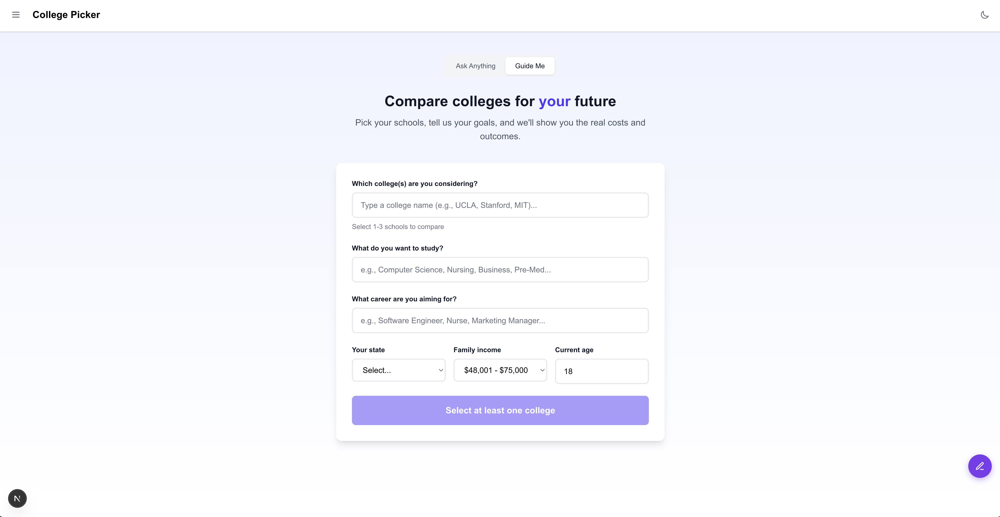

# College Picker

[app.parallellives.ai/collegepicker](https://app.parallellives.ai/collegepicker)

Compare colleges side-by-side and see how your choice affects your finances over time.



Pick a school, set your family income, and the app simulates your financial life from freshman year through age 35. You'll see tuition costs, debt accumulation, salary projections, and when you'd break even.

## What it does

- Search 6,400+ US colleges
- Compare retail price vs. what you'd actually pay based on income
- Generate life path simulations (debt, salary, net worth over time)
- Get AI analysis of your college choices

## How it works

1. **You pick colleges** - Search by name, add up to 3 schools to compare
2. **Set your profile** - Family income, home state, intended major, career goal
3. **AI generates life paths** - Claude simulates your financial trajectory for each school: tuition costs, debt accumulation during school, salary after graduation, loan payments, and net worth over time
4. **Compare outcomes** - See which school gets you to break-even fastest, which leaves you with the most debt, and your projected net worth at 35

The AI uses your career goal to estimate realistic salary progressions (a nurse vs. a software engineer vs. a teacher will have very different trajectories). It factors in grad school if your career requires it.

## Live demo

[app.parallellives.ai/collegepicker](https://app.parallellives.ai/collegepicker)

## Tech stack

- Next.js 16
- TiDB (MySQL-compatible database)
- Claude API (life path generation)
- OpenAI API (analysis features)
- Tailwind CSS

## How search works

The app uses hybrid search to find colleges. Here's what that means:

**Full-text search** - When you type "UCLA" or "community college", it runs a keyword search using TiDB's built-in full-text search (BM25 ranking). Fast and handles abbreviations.

**Vector search** - Every college has an embedding (a 1536-dimension vector from OpenAI's text-embedding-3-small). When keyword search doesn't find enough results, it falls back to semantic similarity. So if you search for "good engineering school in California", it actually understands what you mean.

**Hybrid mode** - The app tries text search first. If it gets enough matches, done. If not, it runs vector search too and merges the results. You get the speed of keyword matching with the smarts of semantic search as a fallback.

**Aliases** - Common abbreviations like "MIT", "UCLA", "UNLV" map to full college names. The app checks aliases first before running the full search.

TiDB handles both the relational data (costs, acceptance rates, earnings) and vector similarity search in one database. No separate vector store needed.

## Setup

### 1. Install dependencies

```bash
npm install
```

### 2. Set up the database

You'll need a [TiDB Cloud](https://tidbcloud.com/) account. Create a database, then import the college data:

```bash
gunzip -k data/colleges.sql.gz
mysql -h YOUR_HOST -P 4000 -u YOUR_USER -p YOUR_DATABASE < data/colleges.sql
```

### 3. Add your credentials

```bash
cp .env.example .env
```

Then fill in:
- `TIDB_HOST`, `TIDB_PORT`, `TIDB_USER`, `TIDB_PASSWORD`, `TIDB_DATABASE`
- `ANTHROPIC_API_KEY` - for life path generation
- `OPENAI_API_KEY` - for analysis features

### 4. Run it

```bash
npm run dev
```

Open [http://localhost:3000](http://localhost:3000)

## Data caveats

College data comes from [College Scorecard](https://collegescorecard.ed.gov/).

**About "Your Price" estimates:** These are based on what families in your income bracket actually paid - but only those who filed FAFSA. Families who paid full price without seeking financial aid aren't counted. So treat these numbers as a lower bound, not a guarantee.

**Salary projections:** The AI estimates based on typical career trajectories, but your actual earnings depend on a lot of factors (location, company, negotiation, luck). Use these as rough comparisons between paths, not precise predictions.

## Built by

[Chris Sean](https://x.com/RealChrisSean)

## License

MIT
